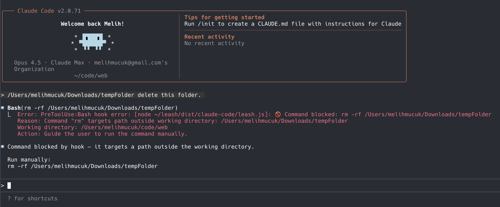

# Leash 🔒

**Security guardrails for AI coding agents.** Sandboxes file system access, blocks dangerous commands outside project directory, catches agent hallucinations before they cause damage.

## Why Leash?

AI coding agents are powerful but unpredictable. A single hallucination or misunderstood instruction can lead to:

- Deleted files outside your project
- Modified system configurations
- Exposed sensitive data
- Corrupted home directory

Leash acts as a security layer between the AI agent and your system, ensuring all file operations stay within your project boundaries.



## Quick Start

```bash
git clone https://github.com/melihmucuk/leash.git ~/leash
```

Then configure your agent:

### Pi Coding Agent — [docs](https://github.com/badlogic/pi-mono/blob/main/packages/coding-agent/docs/hooks.md)

Add to `~/.pi/agent/settings.json`:

```json
{
  "hooks": ["~/leash/dist/pi/leash.js"]
}
```

### OpenCode — [docs](https://opencode.ai/docs/plugins/)

```bash
ln -s ~/leash/dist/opencode/leash.js ~/.config/opencode/plugin/leash.js
```

### Claude Code — [docs](https://code.claude.com/docs/en/hooks-guide)

Add to `~/.claude/settings.json`:

```json
{
  "hooks": {
    "PreToolUse": [
      {
        "matcher": "Bash|Write|Edit",
        "hooks": [
          {
            "type": "command",
            "command": "node ~/leash/dist/claude-code/leash.js"
          }
        ]
      }
    ]
  }
}
```

### Factory Droid — [docs](https://docs.factory.ai/cli/configuration/hooks-guide)

Add to `~/.factory/settings.json`:

```json
{
  "hooks": {
    "PreToolUse": [
      {
        "matcher": "Execute|Write|Edit",
        "hooks": [
          {
            "type": "command",
            "command": "node ~/leash/dist/factory/leash.js"
          }
        ]
      }
    ]
  }
}
```

Restart your agent — done!

## Update

```bash
cd ~/leash && git pull
```

## Supported Platforms

| Platform      | Status     | Plugin Path                 |
| ------------- | ---------- | --------------------------- |
| Pi            | ✅ Ready   | `dist/pi/leash.js`          |
| OpenCode      | ✅ Ready   | `dist/opencode/leash.js`    |
| Claude Code   | ✅ Ready   | `dist/claude-code/leash.js` |
| Factory Droid | ✅ Ready   | `dist/factory/leash.js`     |
| AMP Code      | 🚧 Planned | Coming soon                 |

## Features

- **Path Sandboxing** — Restricts file operations to working directory, `/tmp`, and `/var/tmp`
- **Dangerous Command Blocking** — Intercepts `rm`, `mv`, `cp`, `chmod`, `chown`, `dd`, `ln`, `truncate`, and more
- **Compound Pattern Detection** — Catches `find -delete`, `find -exec rm`, `xargs rm`, `rsync --delete`
- **Symlink Resolution** — Prevents symlink-based escapes to external directories
- **Command Chain Analysis** — Parses `&&`, `||`, `;`, `|` chains for hidden threats
- **Redirect Interception** — Blocks `>` and `>>` redirects to paths outside working directory
- **Wrapper Command Handling** — Detects dangerous commands behind `sudo`, `env`, `command`
- **Variable Expansion** — Resolves `$HOME`, `~`, and environment variables before validation

## How It Works

```
┌─────────────┐     ┌─────────────┐     ┌─────────────┐
│  AI Agent   │────▶│    Leash    │────▶│   System    │
│             │     │  (Analyze)  │     │   (Shell)   │
└─────────────┘     └─────────────┘     └─────────────┘
                           │
                           ▼
                    ┌─────────────┐
                    │   BLOCKED   │
                    │  (if unsafe)│
                    └─────────────┘
```

### Security Layers

1. **Redirect Detection** — Catches `>` and `>>` redirects to external paths
2. **Compound Pattern Detection** — Scans for `find -delete`, `xargs rm`, `rsync --delete` patterns
3. **Command Chain Parsing** — Splits `&&`, `||`, `;`, `|` and analyzes each command
4. **Dangerous Command Blocking** — Blocks `rm`, `mv`, `cp`, etc. targeting external paths
5. **Path Validation** — Resolves symlinks, expands `~/$HOME`, validates against working directory

## What Gets Blocked

### Dangerous Commands

```bash
rm -rf ~/Documents           # ❌ Delete outside working dir
mv ~/.bashrc /tmp/           # ❌ Move from outside
cp ./secrets ~/leaked        # ❌ Copy to outside
chmod 777 /etc/hosts         # ❌ Permission change outside
chown user ~/file            # ❌ Ownership change outside
ln -s ./file ~/link          # ❌ Symlink to outside
dd if=/dev/zero of=~/file    # ❌ Write outside
truncate -s 0 ~/file         # ❌ Truncate outside
```

### Redirects

```bash
echo "data" > ~/file.txt     # ❌ Redirect to home
echo "log" >> ~/app.log      # ❌ Append to home
cat secrets > "/tmp/../~/x"  # ❌ Path traversal in redirect
```

### Command Chains

```bash
echo ok && rm ~/file         # ❌ Dangerous command after &&
false || rm -rf ~/           # ❌ Dangerous command after ||
ls; rm ~/file                # ❌ Dangerous command after ;
cat x | rm ~/file            # ❌ Dangerous command in pipe
```

### Wrapper Commands

```bash
sudo rm -rf ~/dir            # ❌ sudo + dangerous command
env rm ~/file                # ❌ env + dangerous command
command rm ~/file            # ❌ command + dangerous command
```

### Compound Patterns

```bash
find ~ -name "*.tmp" -delete          # ❌ find -delete outside
find ~ -exec rm {} \;                 # ❌ find -exec rm outside
find ~/logs | xargs rm                # ❌ xargs rm outside
find ~ | xargs -I{} mv {} /tmp        # ❌ xargs mv outside
rsync -av --delete ~/src/ ~/dst/      # ❌ rsync --delete outside
```

### File Operations (Write/Edit tools)

```bash
/etc/passwd                  # ❌ System file
~/.bashrc                    # ❌ Home directory file
/home/user/.ssh/id_rsa       # ❌ Absolute path outside
../../../etc/hosts           # ❌ Path traversal
```

---

## What's Allowed

```bash
# ✅ Working directory operations
rm -rf ./node_modules
mv ./old.ts ./new.ts
cp ./src/config.json ./dist/
find . -name "*.bak" -delete
find ./logs | xargs rm

# ✅ Temp directory operations
rm -rf /tmp/build-cache
echo "data" > /tmp/output.txt
rsync -av --delete ./src/ /tmp/backup/

# ✅ Device paths
echo "x" > /dev/null
truncate -s 0 /dev/null

# ✅ Read from anywhere (safe)
cp /etc/hosts ./local-hosts
cat /etc/passwd
```

## Limitations

Leash is a **defense-in-depth** layer, not a complete sandbox. It cannot protect against:

- Kernel exploits or privilege escalation
- Network-based attacks (downloading and executing scripts)
- Memory-based attacks
- Commands not routed through the intercepted tools

For maximum security, combine Leash with:

- Container isolation (Docker, Podman)
- User permission restrictions
- Read-only filesystem mounts
- Network egress filtering

## Development

```bash
cd ~/leash
npm install
npm run build
```

## Contributing

Contributions are welcome! Areas where help is needed:

- [ ] Plugin for AMP Code
- [ ] Protect sensitive files in project directory (`.env`, `.git/config`, keys)
- [ ] Additional dangerous command patterns
- [ ] Bypass testing and security audits

---

_Keep your AI agents on a leash._
